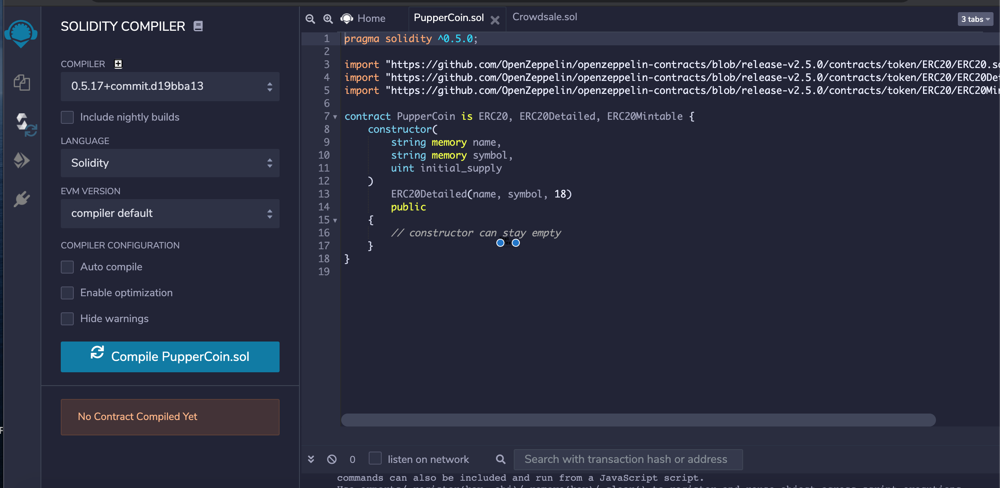
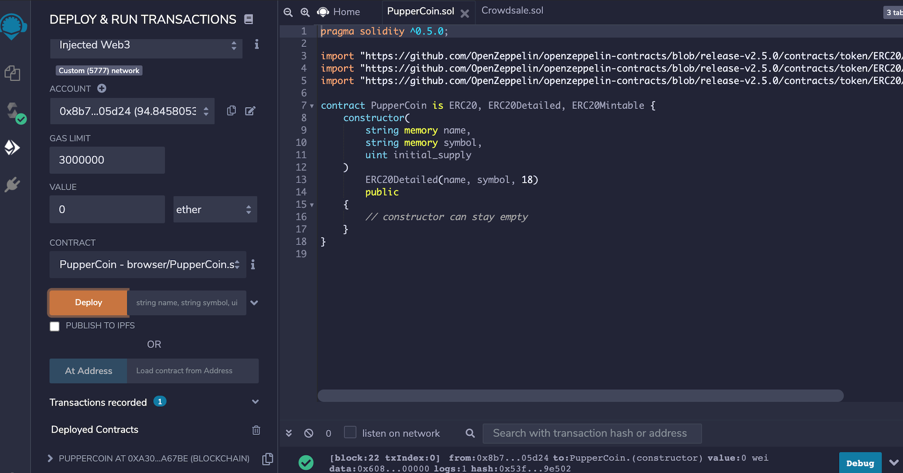
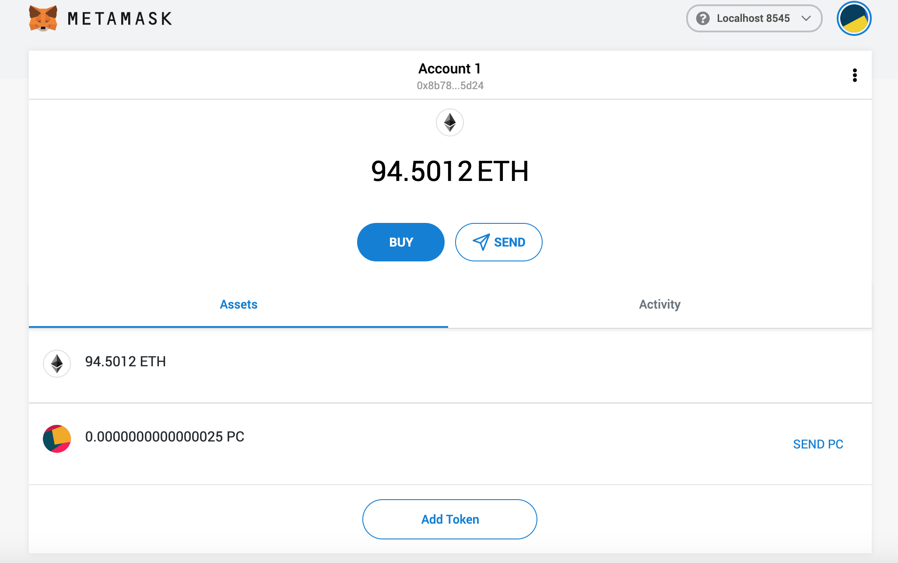
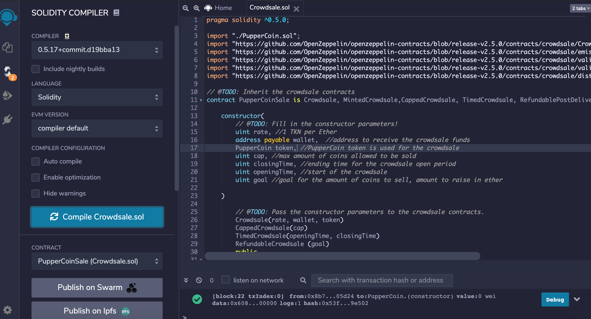
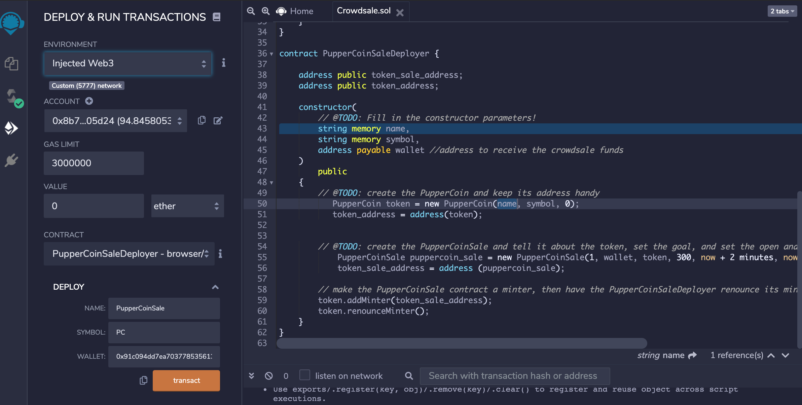
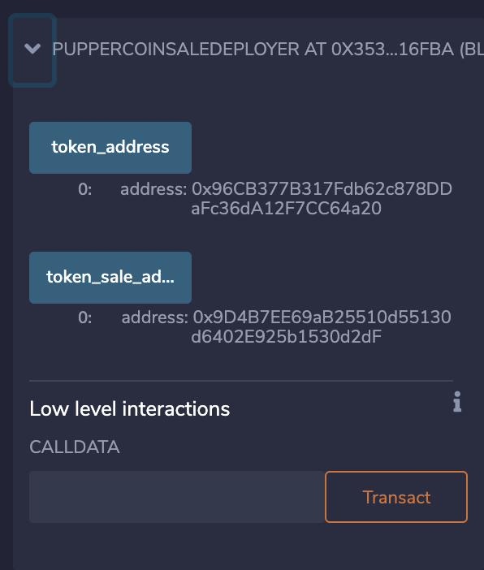
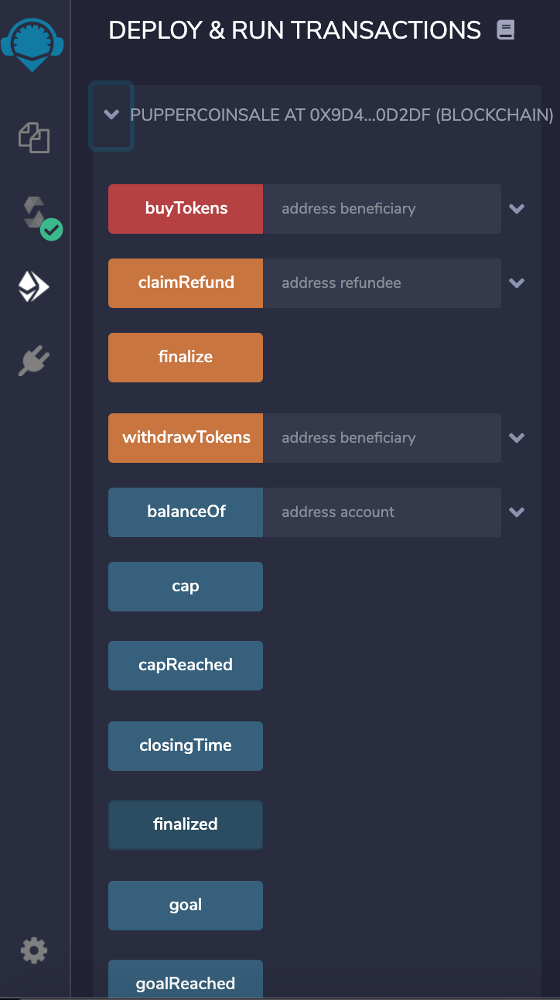
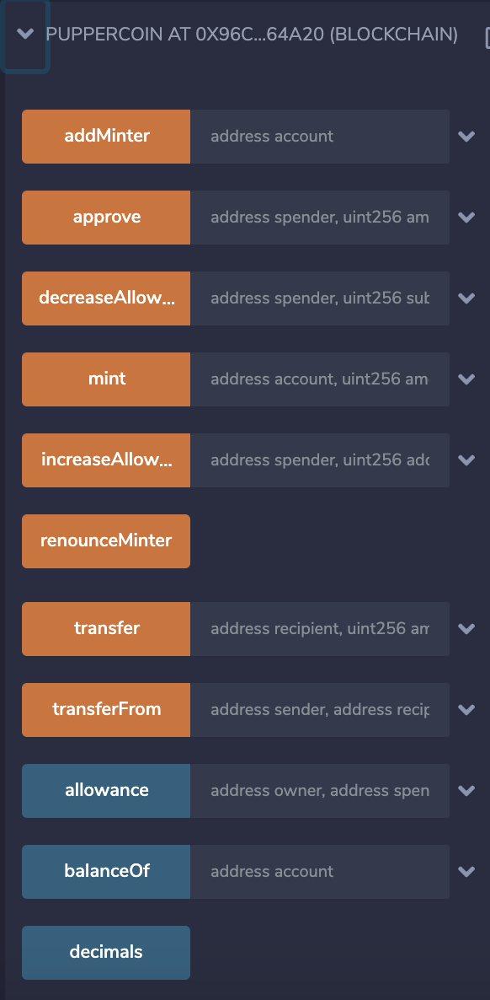

# adv_solidity_hw
The purpose of this exercise is to created a ERC20 token called PupperCoin (PC) on a local testnet and run a crowdsale of the tokens to raise ETH.

The crowdsale is set to last for 24 weeks and have a max amount that can be raised of 300 ETH. This means the cap and the goal for the crowdsale parameters is 300 ETH. 

To start a token called PupperCoin was made on the local testnet. The coin was ERCO detailed and mintable. Here we can see the solidity contract used to min the coin and the existence of the Puppercoin (PC) on the local testnet account.

The next contract that was deployed was used to place contracts on the sale and the deployment of the crowdsale on the local network.

Once the contract is deployed you will see token address and token sale address produced.

You need to use these addresses to deploy the specific contracts to address option.
This gives the following contracts you can view deployed.

Then you can view with in the PupperCoin sale contract all the aspects of the sale. Using the buyTokens red button you can send to the address beneficiary. This will send ETH to the beneficiary address for purchasing tokens.

Here we can see all the aspects of Puppercoin if we click on these buttons.

Each time a beneficiary is used to buy tokens, the crowdsale is funded in the token sale address. What should be seen is that when the funding address for the crowdsale recieves the goal of 300 ETH or when the time reaches 24 weeks from the start of the crowdsale, the crowdsale should terminate and the contract will close out. 

